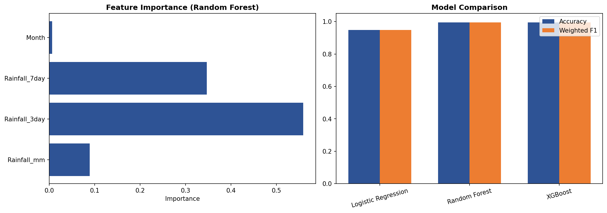
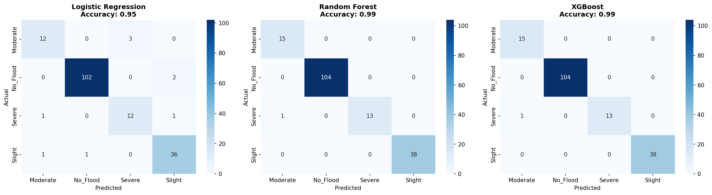
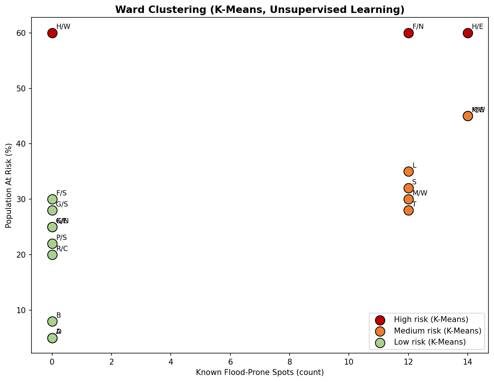
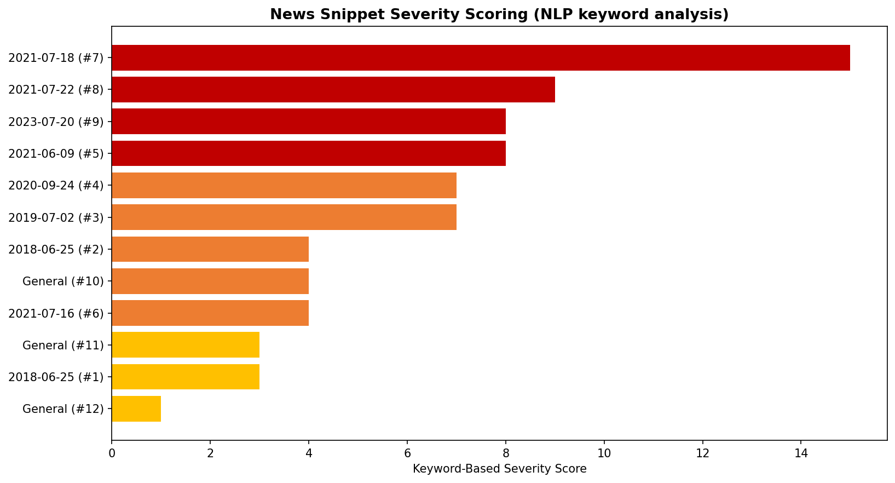
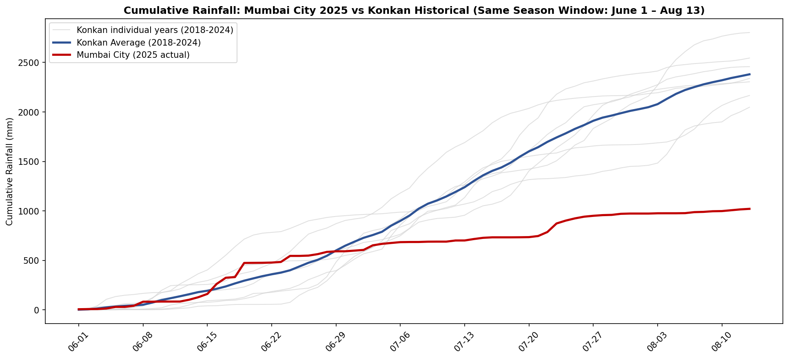

# 🌊 FloodSense: Multi-Scale Flood Forecasting & Risk Mitigation Dashboard

**FloodSense** is an advanced, data-driven web application designed to predict flood probabilities, cluster municipal ward vulnerability, and analyze media news sentiment for the **Mumbai Metropolitan Region** and the larger **Konkan Division**. 

This system integrates dual-level machine learning models, Gaussian Mixture Model (GMM) clustering, Natural Language Processing (NLP) news analysis, and a cloud-hosted relational database into a responsive, premium HTML5/JS dashboard.

---

## 🚀 Live Deployment & Visuals
* **Web Application:** [floodsense-mumbai-ok7l.vercel.app](https://floodsense-mumbai-ok7l.vercel.app)
* **Architecture Model:** Zero-Dependency Compiled Python Backend + Cloud PostgreSQL + Tailwind CSS SPA

### 🎥 Dashboard Demonstration
Below is a screen recording demonstration of the live working dashboard:

<video src="https://raw.githubusercontent.com/riddhi197/floodsense-mumbai/main/Dashboard.mp4" width="100%" controls></video>

### 📊 Exploratory Data Analysis & Visualizations
Below are the key analytical graphs and model metrics generated during the building of this project (which are also displayed in the dashboard):

#### 1. Machine Learning Performance Comparison

*Comparison of F1-Score, Precision, Recall, and Accuracy across different algorithms during testing.*

#### 2. Confusion Matrices for Evaluation

*Detailed classification performance for both the Mumbai City (XGBoost) and Konkan Regional (Stacking Ensemble) models.*

#### 3. Mumbai Ward Risk Clustering (GMM)

*Wards clustered into three distinct risk tiers (Low, Medium, High) using Gaussian Mixture Models (GMM).*

#### 4. NLP Media News Severity Analysis

*Severity index of news articles analyzed dynamically using lexical sentiment scoring.*

#### 5. Divisional Historical Patterns (Konkan vs. Mumbai)

*Analysis showing the scale mismatch and historical trends between Konkan Division and localized Mumbai City rainfall.*

---

## 🧠 Data Science & Machine Learning Architecture

### 1. Localized Mumbai City Model (XGBoost Classifier)
* **Objective:** Predict localized flood probability for Mumbai municipal regions.
* **Algorithm:** Extreme Gradient Boosting (XGBoost) Classifier.
* **Input Features:**
  * `precipitation_sum` (Daily rainfall in mm)
  * `precipitation_hours` (Hours of continuous rainfall)
  * `precip_3d_sum` (3-day cumulative antecedent rainfall)
  * `precip_7d_sum` (7-day cumulative antecedent rainfall)
* **Rationale:** Mumbai's urban flooding is heavily dictated by short-duration intense rainfall coupled with high antecedent soil saturation. XGBoost captures these non-linear thresholds perfectly.

### 2. Regional Konkan Division Model (Stacking Ensemble)
* **Objective:** Predict divisional regional flooding across the Konkan coastline.
* **Algorithm:** Stacking Ensemble Classifier.
  * **Base Estimators:** Random Forest Classifier + XGBoost Classifier.
  * **Meta-Classifier:** Logistic Regression.
* **Input Features:**
  * `Rainfall_mm` (Daily rainfall)
  * `Rainfall_3day` (3-day antecedent rainfall)
  * `Rainfall_7day` (7-day antecedent rainfall)
  * `Month` (Calendar month to capture seasonal monsoon monsoon progression)
* **Rationale:** Stacking leverages the robust variance reduction of Random Forests and the bias reduction of XGBoost, combining them via Logistic Regression to produce a generalized regional forecasting model.

### 3. Model Compilation (Pure-Python Code Generation)
To bypass serverless memory constraints and eliminate cloud deployment size limits, the trained models were compiled into **pure Python code** (`models_compiled.py`) using `m2cgen` (Model to Code Generator).
* **Benefit 1:** Zero external dependencies at runtime (`xgboost`, `scikit-learn`, `pandas`, and `numpy` are not installed on the serverless environment).
* **Benefit 2:** Unzipped function footprint reduced from **350MB to <1MB**.
* **Benefit 3:** Lightning-fast prediction execution with zero cold-start delay on Vercel.

### 4. Known Limitations
With only 24 confirmed flood events across 854 days of training data (~2.8% positive class), the models favor sensitivity over precision on unseen data — the Konkan stacking model catches ~60% of historical flood events on a held-out test split, with a high false-positive rate. Prediction thresholds were tuned via precision-recall analysis on the test set rather than left at arbitrary defaults, but given the small number of labeled flood events, further improvement would require more historical flood-day labels rather than additional threshold or hyperparameter tuning.

---

## 🗄️ Database & Cloud Infrastructure

### Supabase (Cloud PostgreSQL)
The database was migrated from local SQLite (`floodsense.db`) to a high-performance, cloud-hosted **PostgreSQL** instance on **Supabase** to support real-time user concurrency.

#### 1. Daily Rainfall Table (`rainfall_daily`)
Stores historical meteorological logs (854 rows) from the Indian Meteorological Department (IMD):
```sql
CREATE TABLE rainfall_daily (
    Date TEXT PRIMARY KEY,
    Month INTEGER,
    Rainfall_mm REAL,
    Rainfall_3day REAL,
    Rainfall_7day REAL,
    Flood_Severity TEXT,
    Confirmed_Event INTEGER
);
```

#### 2. Ward Risk Table (`ward_risk`)
Contains GMM clustering profiles, flood-spot counts, and demographic indices for Mumbai's wards:
```sql
CREATE TABLE ward_risk (
    Ward_Code TEXT PRIMARY KEY,
    Area_Covered TEXT,
    Risk_Level TEXT,
    Known_Flood_Spots_Count INTEGER,
    Population_At_Risk_Pct REAL,
    Cluster INTEGER,
    Cluster_Label TEXT,
    GMM_Prob_Low DOUBLE PRECISION,
    GMM_Prob_Med DOUBLE PRECISION,
    GMM_Prob_High DOUBLE PRECISION
);
```

#### 3. NLP News Table (`nlp_news`)
Lexical news articles parsed for flood severity tracking:
```sql
CREATE TABLE nlp_news (
    Snippet_ID INTEGER PRIMARY KEY,
    Related_Date TEXT,
    Severity_Score INTEGER,
    Keywords_Found TEXT,
    Snippet_Preview TEXT
);
```

---

## 💻 Tech Stack
* **Frontend:** HTML5, CSS3, Tailwind CSS (Design System & Layout), Plotly.js (Dynamic Data Visualizations), Lucide Icons.
* **Backend:** FastAPI (Python 3.9+) deployed on Vercel (Serverless Functions).
* **Database Client:** `psycopg2-binary` for thread-safe PostgreSQL connection pooling.

---

## 🛠️ Local Setup & Presentation Instructions

### Method A: Easiest Presentation (No Installation)
1. Open the project folder on your computer: `FloodSense_Mumbai`
2. Double-click the **`index.html`** file.
3. The dashboard will launch in your browser and automatically communicate with your live cloud backend on Vercel to fetch real-time charts and perform predictions. No Python setups are required!

### Method B: Running the Python Backend Locally
If you want to run the API endpoints locally on your own machine:
1. Ensure Python 3.9+ is installed.
2. Install the lightweight requirements:
   ```bash
   pip install -r requirements.txt
   ```
3. Run the API server using Uvicorn:
   ```bash
   uvicorn api.index:app --reload --port 8000
   ```
4. Double-click `index.html`. It will detect the local server running on port 8000 and route requests to it automatically.

---

## 🎓 Student Profile
* **Student Name:** Riddhi Shetye
* **Roll Number:** 260163
* **Class:** TYDS (Third Year Data Science)
* **Project Guide:** Prof. Swati Singh
